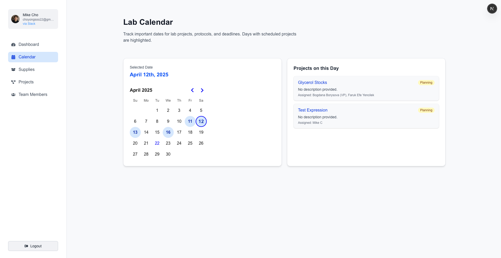

# 🧪 LabGoat

**LabGoat** is a modern, extensible Laboratory Information Management System (LIMS) designed specifically for iGEM teams. It streamlines wet lab logistics, protocol tracking, project management, and inventory—all with a clean UI and Supabase integration. This is an early development version branched from McMasterU's iGEM cycle, created with the goal of improving generalizability. Features planned for this public release include:

## 🚀 Features

- 🔐 **User Authentication** with Supabase (email + Slack OAuth)
- 🧫 **Protocol Flow Builder** – Drag-and-drop workflows for lab pipelines
- 🗃️ **Dynamic Supplies Table** with CSV upload, search, edit mode, and export
- 📊 **Project Tracker** with status tags, due dates, and assignees
- 📈 **Mobile Build** (planned)

## 🏗️ Tech Stack

- **Frontend**: Next.js 14 (App Router), TailwindCSS, React Flow
- **Auth & Backend**: Supabase
- **Database**: PostgreSQL (via Supabase)
- **File Uploads**: Supabase Storage
- **Icons**: React Icons, FontAwesome
- **UI**: Headless UI 

<h2>📸 Screenshots</h2>

<table>
  <tr>
    <td align="center">
      <br/>
      <strong>Login Page</strong>
    </td>
    <td align="center">
      <br/>
      <strong>Dashboard</strong>
    </td>
    <td align="center">
      <br/>
      <strong>Calendar</strong>
    </td>
  </tr>
  <tr>
    <td align="center">
      <br/>
      <strong>Project List View</strong>
    </td>
    <td align="center">
      <br/>
      <strong>Project Flow View</strong>
    </td>
    <td align="center">
      <br/>
      <strong>New Project Modal</strong>
    </td>
  </tr>
  <tr>
    <td align="center">
      <br/>
      <strong>Inventory Manager</strong>
    </td>
    <td></td>
    <td></td>
  </tr>
</table>
  
## Getting Started

Enable SLack OAuth provider (if needed) and add the following .env file to access Supabase

NEXT_PUBLIC_SUPABASE_URL=https://your-project.supabase.co

NEXT_PUBLIC_SUPABASE_ANON_KEY=your_anon_key

Next, run the development server:

```bash
npm run dev
# or
yarn dev
# or
pnpm dev
# or
bun dev
```

Open [http://localhost:3000](http://localhost:3000) with your browser to see the result.

This project uses [`next/font`](https://nextjs.org/docs/app/building-your-application/optimizing/fonts) to automatically optimize and load [Geist](https://vercel.com/font), a new font family for Vercel.

MIT License. Built with 💙 by and for the iGEM community.
